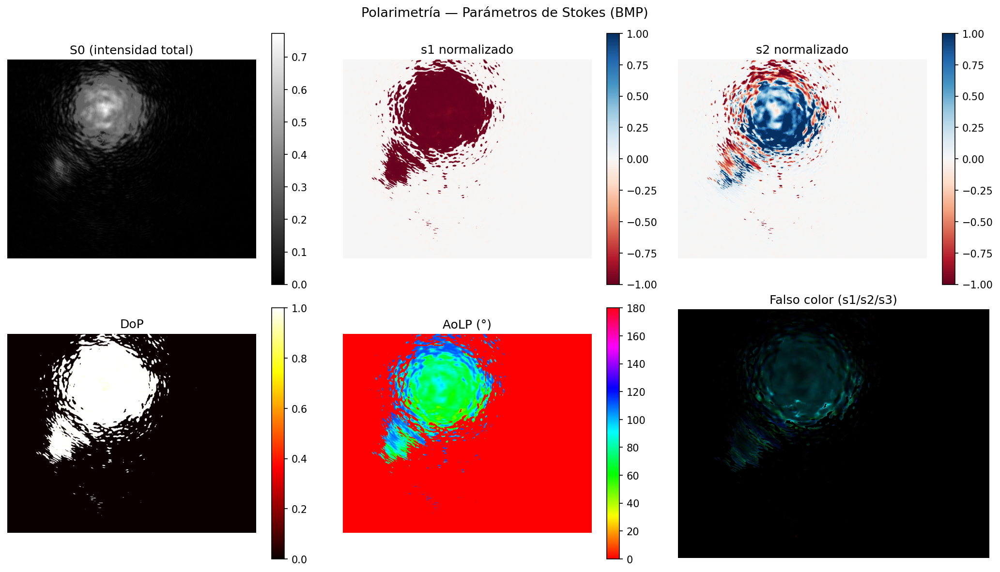

# CAM — Análisis Polarimétrico

Scripts de análisis de imágenes para cámara polarimétrica. A partir de cuatro fotografías capturadas con distintas orientaciones de polarizador y retardador de cuarto de onda, se reconstruyen los **parámetros de Stokes** completos y se generan mapas 2D del estado de polarización píxel a píxel.



---

## Cómo funciona el código

### 1. Adquisición del montaje óptico

El sistema usa una cámara CCD (Thorlabs DCC) precedida por un polarizador lineal y un retardador de cuarto de onda (λ/4). Al girar ambos elementos a cuatro ángulos distintos se obtienen cuatro medidas de intensidad independientes que permiten determinar el vector de Stokes completo:

```
Medida        Polarizador   Retardador   Variable
─────────────────────────────────────────────────
I_0_0.bmp         0°            0°         I0
I_45_0.bmp        45°           0°         I45
I_90_0.bmp        90°           0°         I90
I_45_90.bmp       45°           90°        I4590
```

### 2. Normalización a punto flotante

Cada imagen BMP (uint8, 8 bits por píxel) se convierte a `float64` en el rango `[0, 1]` dividiendo por el valor máximo del tipo de dato:

```python
image_float = img.astype(np.float64) / np.iinfo(img.dtype).max
```

Esto preserva la precisión numérica completa durante todas las operaciones algebraicas posteriores, evitando errores de redondeo o desbordamiento que ocurrirían si se trabajara en enteros.

### 3. Cálculo de los parámetros de Stokes

Con las cuatro intensidades se construye el vector de Stokes mediante combinaciones lineales:

```
S0 = I0 + I90              → intensidad total
S1 = I0 − I90              → polarización lineal a 0°/90°
S2 = 2·I45 − I0 − I90      → polarización lineal a ±45°
S3 = 2·I4590 − I0 − I90    → polarización circular
```

Normalizados respecto a S0 (para eliminar la dependencia de la intensidad de la fuente):

```
s1 = S1/S0,  s2 = S2/S0,  s3 = S3/S0   ∈ [−1, 1]
```

### 4. Propiedades de polarización derivadas

```
DoP  = √(s1² + s2² + s3²)     Grado de polarización total   ∈ [0, 1]
AoLP = ½·arctan2(s2, s1)       Ángulo de polarización lineal ∈ [0°, 180°)
DoCP = |s3|                     Grado de polarización circular ∈ [0, 1]
```

### 5. Enmascarado

Se aplica un umbral sobre S0 (`umbral = 0.05`) para ignorar píxeles sin señal (fondo oscuro, bordes de la apertura). Los píxeles enmascarados se ponen a cero en todas las salidas.

### 6. Visualización

Se genera un panel de seis mapas (`panel_polarimetria.png`):

| Panel | Descripción |
|---|---|
| S0 | Intensidad total (escala de grises) |
| s1 | Stokes lineal horizontal/vertical (mapa rojo–azul) |
| s2 | Stokes lineal diagonal (mapa rojo–azul) |
| DoP | Grado de polarización (mapa térmico) |
| AoLP | Ángulo de polarización en grados (mapa cíclico HSV) |
| Falso color | Imagen RGB con R=s1, G=s2, B=s3 |

---

## Instalación

```bash
python -m venv venv
source venv/bin/activate
pip install numpy matplotlib opencv-python Pillow
```

## Uso

1. Coloca las cuatro imágenes BMP en el directorio del proyecto con los nombres exactos:
   `I_0_0.bmp`, `I_45_0.bmp`, `I_90_0.bmp`, `I_45_90.bmp`

2. Ejecuta:
   ```bash
   source venv/bin/activate
   python CamPol_3.py
   ```

3. El script imprime en consola las estadísticas promedio de la región iluminada y abre el panel de resultados. Todos los mapas se guardan como PNG en el mismo directorio.

---

## Archivos de salida

| Archivo | Contenido |
|---|---|
| `panel_polarimetria.png` | Panel resumen con los seis mapas |
| `DoLP_map.png` | Grado de polarización lineal [0, 1] |
| `AoLP_map.png` | Ángulo de polarización lineal [0°, 180°) |
| `DoCP_map.png` | Grado de polarización circular [0, 1] |
| `RGB_Stokes.png` | Falso color (R=s1, G=s2, B=s3) |
| `Mask.png` | Máscara binaria de píxeles válidos |

---

## Estructura del proyecto

| Archivo | Descripción |
|---|---|
| `CamPol_3.py` | Script principal — BMP entrada, Stokes en float64 |
| `CamPol_4.py` | Variante con enmascarado adicional basado en S0 |
| `CamPol_5.py` | Pipeline completo con salida estadística y 4 PNGs |
| `CamPolCalib.py` | Análisis de calibración |
| `captura_dcc.py` | Captura de imágenes desde cámara Thorlabs DCC |

---

## Captura con cámara Thorlabs DCC

```bash
python captura_dcc.py
```

Intenta captura mediante el SDK IDS uEye nativo (pyueye). Si el SDK no está instalado, usa OpenCV como fallback UVC. Las imágenes se guardan en `capturas_raw/` como TIFF.

Para habilitar el SDK nativo descarga IDS Peak desde `https://en.ids-imaging.com/ids-peak.html`.
