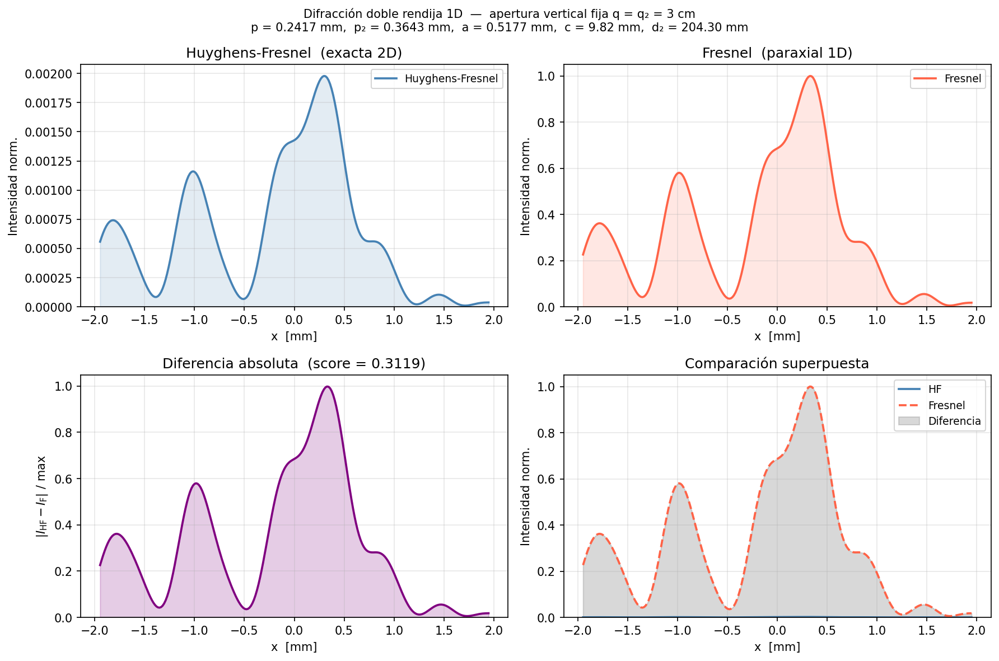
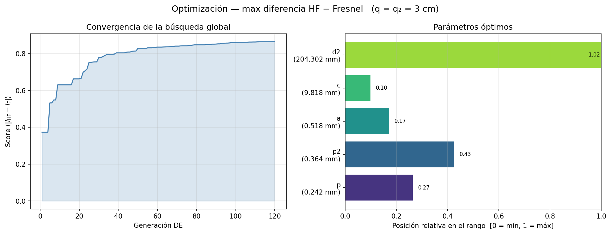
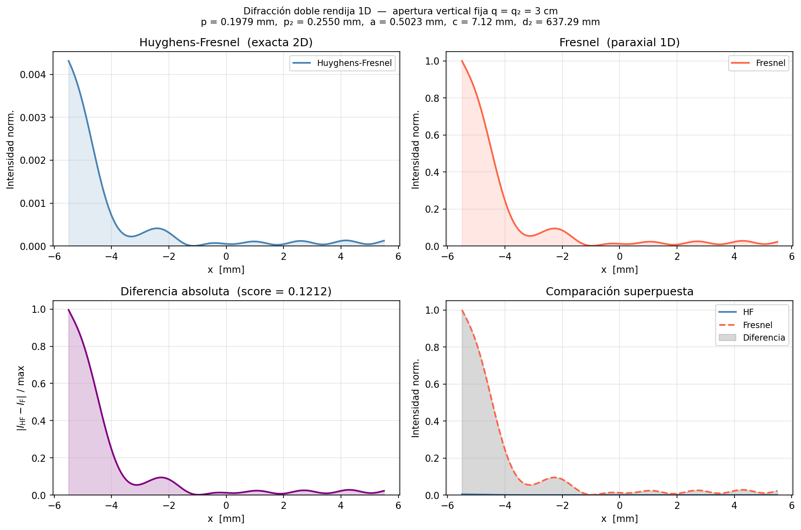

# Simulador de Difracción por Doble Rendija

Comparación numérica de la integral de **Huyghens-Fresnel** (exacta) versus la integral de **Fresnel** (aproximación paraxial) para dos rendijas rectangulares con apertura vertical fija **q = q₂ = 3 cm**.

La diferencia entre ambos métodos es máxima cuando la aproximación paraxial falla: rendijas pequeñas, distancias cortas, o geometría fuera del eje.

---

## Física del problema

La luz difractada por una rendija rectangular se calcula mediante dos integrales:

**Huyghens-Fresnel** (kernel cilíndrico exacto 2D en x):

$$U(x_0) \propto \int_{x_2} \left[\int_{x_1} \frac{e^{ik r_{12}}}{\sqrt{r_{12}}} \, dx_1\right] \frac{e^{ik r_2}}{\sqrt{r_2}} \, dx_2$$

con $r_{12} = \sqrt{(x_2-x_1)^2 + c^2}$ y $r_2 = \sqrt{(x_0-x_2)^2 + d_2^2}$.

**Fresnel** (paraxial, aproximación $r \approx z + \Delta x^2/2z$):

$$U(x_0) \propto \int_{x_2} \left[\int_{x_1} e^{ik(x_2-x_1)^2/2c} \, dx_1\right] e^{ik(x_0-x_2)^2/2d_2} \, dx_2$$

### Geometría de la doble rendija

```
Rendija 1               Rendija 2          Plano de observación
centrada en x=0         centrada en x=a
ancho: p  [mm]          ancho: p₂ [mm]
apertura vertical: q = q₂ = 3 cm (fija)
─────────────────────────────────────────────────────────────────▶ z
     z=n              z=n+c              z=n+c+d₂
     │←─────── c ────────→│←───── d₂ ────────→│
```

### ¿Por qué q = 3 cm no aparece en los cálculos?

Con $\lambda = 632.8$ nm y $q = 3$ cm, el número de Fresnel en y es:

$$N_F^{(y)} = \frac{(q/2)^2}{\lambda z} \gg 1 \quad \text{(régimen geométrico)}$$

En este límite, la contribución de y es **idéntica** en ambos métodos (factor multiplicativo que cancela en la diferencia normalizada). La comparación HF − Fresnel es **puramente en x**, donde las aperturas $p$, $p_2 \ll q$ permiten que el número de Fresnel sea $N_F^{(x)} \sim 1$–12.

La métrica optimizada es:

$$\text{score} = \left\langle\left|\frac{I_\mathrm{HF}}{I_\mathrm{max}} - \frac{I_\mathrm{Fresnel}}{I_\mathrm{max}}\right|\right\rangle \in [0, 1]$$

---

## Instalación

```bash
# Clonar el repo y entrar al proyecto
cd Python/Propagador

# Entorno virtual (recomendado)
python -m venv .venv
source .venv/bin/activate

# Dependencias
pip install numpy matplotlib scipy
```

No se requiere compilación previa. Compatible con Python 3.9+.

---

## Uso

### 1. Simulación directa

```bash
python simulador_difraccion.py
```

Lanza el simulador con parámetros de ejemplo (dos rendijas de 0.10 mm separadas 0.30 mm en x, c = 20 mm, d₂ = 150 mm) y genera la figura comparativa en `simulacion_ejemplo.png`.

Para usar parámetros propios desde Python:

```python
from simulador_difraccion import DifraccionDosRendijas

sim = DifraccionDosRendijas(
    p      = 0.20e-3,   # ancho rendija 1 [m]
    p2     = 0.25e-3,   # ancho rendija 2 [m]
    a      = 0.50e-3,   # posición x rendija 2 [m]
    c      = 7e-3,      # separación z entre rendijas [m]
    d2     = 637e-3,    # distancia rendija 2 → observación [m]
    n      = 10e-3,     # posición z rendija 1 [m]
    N_obs  = 256,       # puntos de observación en x
    N_quad = 60,        # puntos de cuadratura GL (≥40 es preciso)
    x_range= 5e-3,      # ventana de observación [m]
)
score = sim.run(guardar_imagen="mi_simulacion.png")
```

La figura resultante tiene 4 paneles:

| Panel | Contenido |
|-------|-----------|
| Superior izq. | Perfil de intensidad HF (exacto) |
| Superior der. | Perfil de intensidad Fresnel (paraxial) |
| Inferior izq. | Diferencia absoluta $\|I_\mathrm{HF} - I_F\|$ |
| Inferior der. | Superposición de ambos métodos |

### 2. Optimización automática

```bash
python optimizador_parametros.py
```

Ejecuta la búsqueda global (Evolución Diferencial) + refinamiento (Nelder-Mead) para encontrar la familia de parámetros que **maximizan** la diferencia HF − Fresnel. Genera:

- `parametros_optimos.json` — mejor solución (semilla 42)
- `familia_parametros.json` — familia de 3 soluciones adicionales
- `convergencia_optimizacion.png` — curva de convergencia del optimizador
- `simulacion_optima.png` — figura comparativa con los parámetros óptimos
- `simulacion_mejor_familia.png` — figura del mejor miembro de la familia

El espacio de búsqueda es:

| Parámetro | Descripción | Rango |
|-----------|-------------|-------|
| `p` | Ancho horizontal rendija 1 | 0.04 – 0.80 mm |
| `p2` | Ancho horizontal rendija 2 | 0.04 – 0.80 mm |
| `a` | Posición x rendija 2 | 0.00 – 3.00 mm |
| `c` | Separación z entre rendijas | 2.00 – 80.0 mm |
| `d2` | Distancia rendija 2 → observación | 5.00 – 200.0 mm |

Restricción numérica: $N_F^{(x)} = (p/2)^2/(\lambda c) \leq 12$ garantiza que la cuadratura GL resuelva correctamente el integrando.

#### Cargar y usar parámetros guardados

```python
from optimizador_parametros import cargar_json, validar

params, score = cargar_json("parametros_optimos.json")
validar(params, show_plots=True)
```

---

## Resultados

### Parámetros óptimos (semilla 42, score = 0.866)

```
q = q₂ = 3 cm  (apertura vertical, fija)
p    = 0.2417 mm   (N_F = 2.35)
p₂   = 0.3643 mm   (N_F = 0.26)
a    = 0.5177 mm
c    = 9.82   mm
d₂   = 204.30 mm
```

### Figura comparativa — parámetros óptimos



*Perfil de intensidad HF (azul), Fresnel (rojo punteado) y diferencia (morado). Score de validación = 0.312.*

### Convergencia del optimizador



*Izquierda: evolución del score por generación de Evolución Diferencial. Derecha: posición de cada parámetro óptimo en su rango de búsqueda.*

### Familia de soluciones

Las siguientes configuraciones maximizan la diferencia HF − Fresnel desde distintos puntos de partida:

| # | `p` (mm) | `p₂` (mm) | `a` (mm) | `c` (mm) | `d₂` (mm) | score (opt.) |
|---|----------|-----------|----------|----------|-----------|-------------|
| 1 (semilla 7)  | 0.1979 | 0.2550 | 0.5023 | 7.12  | 637.3 | 0.939 |
| 2 (semilla 13) | 0.0355 | 0.7614 | 0.0001 | 31.23 | 256.3 | 0.912 |
| 3 (semilla 1)  | 0.4067 | 0.6122 | 0.7927 | 25.82 | 717.4 | 0.866 |

> Los scores de la tabla son los del optimizador (baja resolución). Los scores de validación con alta resolución son menores (la resolución alta captura variaciones rápidas que promedian hacia abajo).



*Simulación con los parámetros de mayor score en la familia (semilla 7).*

### Interpretación física

La diferencia HF − Fresnel es máxima cuando:
- **$N_F^{(x)} \sim 2$–4**: transición entre régimen de Fresnel cercano y paraxial. La aproximación $r \approx z + \Delta x^2/2z$ comete errores de fase apreciables.
- **$d_2 \gg c$**: la segunda propagación es larga, amplificando las diferencias acumuladas en la primera.
- **$a > 0$**: el descentrado de la rendija 2 introduce asimetría que diferencia los patrones.

---

## Estructura de archivos

```
Propagador/
├── simulador_difraccion.py     # Clase DifraccionDosRendijas (HF y Fresnel 1D en x)
├── optimizador_parametros.py   # Búsqueda DE + Nelder-Mead; función buscar_familia()
├── parametros_optimos.json     # Mejor solución encontrada
├── familia_parametros.json     # Familia de soluciones adicionales
├── requirements.txt            # numpy, matplotlib, scipy
├── Teoría.pdf                  # Derivación de las integrales (ecs. 7–9)
├── simulacion_optima.png       # Figura comparativa — parámetros óptimos
├── simulacion_mejor_familia.png# Figura comparativa — mejor familia
└── convergencia_optimizacion.png # Curva de convergencia
```

---

## Referencias

- Goodman, J. W. *Introduction to Fourier Optics*, 3ª ed. (2005) — Capítulo 4, difracción de Fresnel.
- Born & Wolf, *Principles of Optics*, 7ª ed. (1999) — §8.3, integral de Huyghens-Fresnel.
- Documento interno: *Teoría sobre la propagación de fotones por una y dos rendijas* (feb. 2026) — `Teoría.pdf`.
- λ = 632.8 nm (láser He-Ne estándar).
