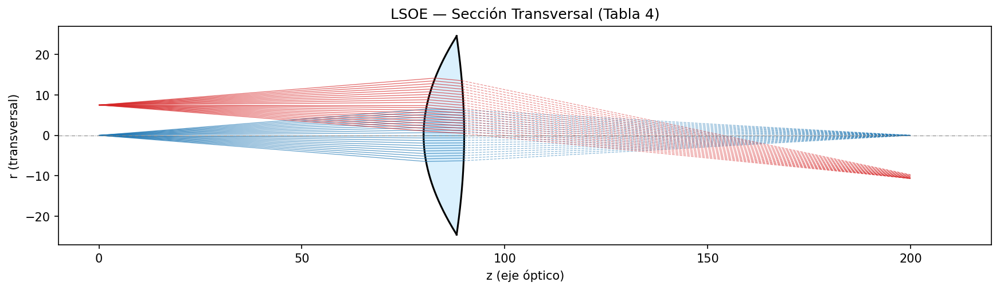
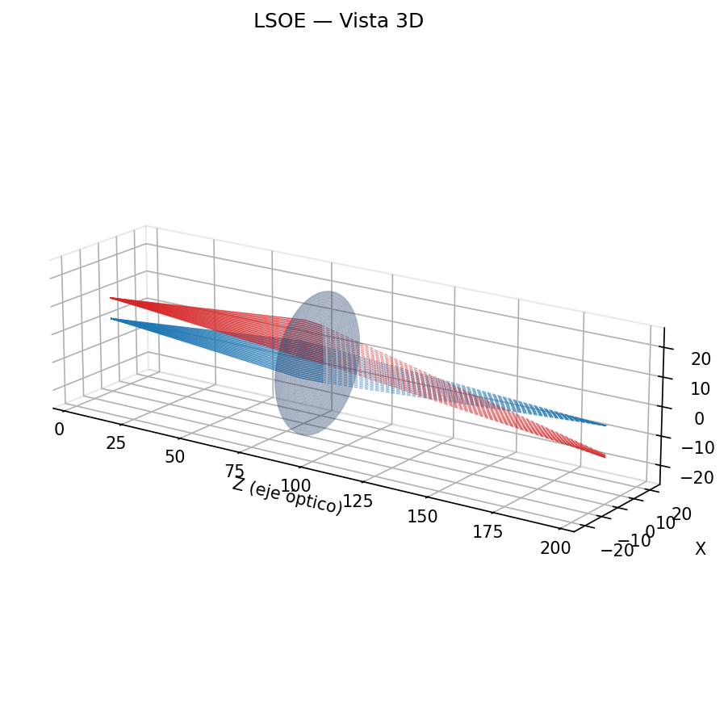
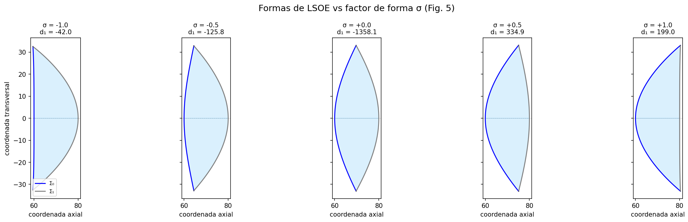
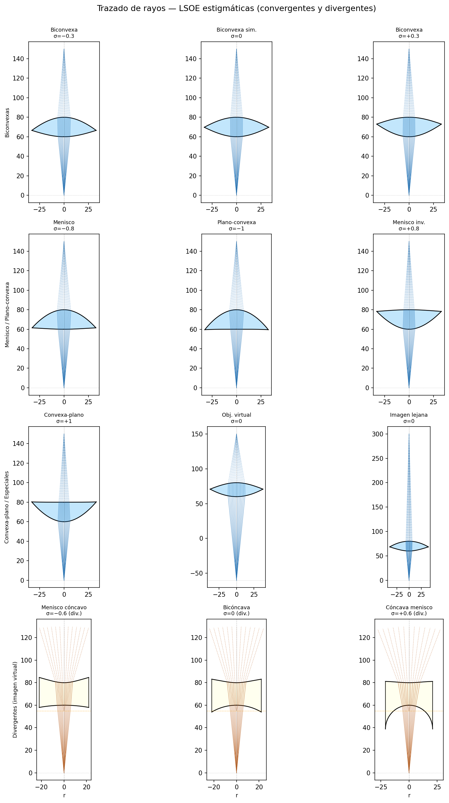

# GOTS Ray Tracing

Exact ray tracing through **Cartesian oval surfaces** (Descartes ovoids) using the GOTS parametric formulation. Based on the doctoral thesis *"Estudio de las aberraciones primarias a partir de la teoría del estigmatismo riguroso"* by Alberto Silva Lora (Universidad Industrial de Santander, 2024).

## What it does

- Computes GOTS shape parameters (G, O, T, S) from physical specifications (Eqs. 10–13)
- Finds exact ray–surface intersections by solving a quartic polynomial (Eq. 51)
- Applies vectorial Snell's law for 3D refraction (Eq. 68)
- Supports multi-surface sequential systems
- Designs **LSOE** (Lentes Singletes Ovoides Estigmáticas) with a shape factor σ
- Surfaces are clipped at their physical **aperture** (mutual intersection of both ovals)
- Generates 2D meridional section and full 3D visualizations
- Exports **watertight STL** for 3D printing

## Gallery

### LSOE — Sección transversal (Tabla 4)
Rigorous stigmatism verified: on-axis rays converge with residual r < 10⁻¹⁴ at the image plane.



### LSOE — Vista 3D



### Lens shapes vs shape factor σ (Fig. 5)
From plano-convex (σ = −1) to convex-plano (σ = +1).



### Ray-tracing gallery — convergent and divergent lenses (Fig. 10)
Blue lenses: converging (real image). Yellow lenses: diverging (virtual image, d₂ < ζ₀).
Diverging lenses show **biconcave/concave-meniscus** shapes with rays spreading after the lens;
dashed backward extensions converge at the virtual focus.



---

## Setup

```bash
cd Python/RayTracing
python3 -m venv venv
source venv/bin/activate      # Windows: venv\Scripts\activate
pip install -r requirements.txt
```

## Running the examples

### LSOE from Table 4 — reference lens (Figs. 11–12)

```bash
python ejemplos/ejemplo_lsoe.py           # with STL export (default)
python ejemplos/ejemplo_lsoe.py --no-stl  # skip STL
```

Traces rays through the thesis reference LSOE (object z=0, image z=200, n₁=1.6).
Prints GOTS parameters and verifies rigorous stigmatism (convergence error < 10⁻¹⁴).

### Lens shapes vs σ (Fig. 5)

```bash
python ejemplos/ejemplo_formas_lsoe.py
```

Draws five LSOE cross-sections for σ = −1, −0.5, 0, +0.5, +1.

### Ray-tracing gallery — convergent + divergent (Fig. 10)

```bash
python ejemplos/ejemplo_fig10.py          # no STL (default)
python ejemplos/ejemplo_fig10.py --stl    # export one STL per lens
```

4×3 panel with 12 LSOE configurations:
- Rows 1–3: converging lenses (biconvex, meniscus, plano-convex, virtual object, …)
- Row 4: **diverging lenses** (virtual image, d₂ < ζ₀) — biconcave and concave-meniscus shapes

**How diverging LSOE works:** setting d₂ slightly below ζ₀ (e.g. d₂=55 with ζ₀=60) produces
surfaces with O₀ < 0 (first surface concave, curves away from object) and O₁ > 0 (second
surface also concave from the exit side). The lens is thicker at the rim than at the center.
Rays refracted through both surfaces diverge; their backward extensions converge at the virtual
focus d₂. Root selection in the σ-formula always chooses d₁ **outside** [ζ₀, ζ₁] to guarantee
the correct sign of curvature.

---

## Using the library

### Quick start — LSOE singlet

```python
import numpy as np
from gots import (
    SistemaOptico, SuperficieCartesiana,
    calcular_gots, graficar_seccion_transversal, graficar_3d,
    exportar_sistema_stl
)

# Design a stigmatic singlet lens
sistema, d1 = SistemaOptico.lsoe(
    zeta_0=80, zeta_1=90,      # vertex positions (mm)
    d_0=0, d_2=200,            # object and image positions
    n_0=1.0, n_1=1.6, n_2=1.0,# refractive indices
    sigma=0.0                  # shape factor: -1 (plano-convex) … +1 (convex-plano)
)

# Trace a fan of rays from an on-axis point source
fuente = np.array([0.0, 0.0, 0.0])
resultados = sistema.trazar_abanico(fuente, num_rayos=21, angulo_max=0.08)

# Visualize
colores = ['tab:blue'] * len(resultados)
graficar_seccion_transversal(sistema, resultados,
                              colores_rayos=colores, z_imagen=200.0)
graficar_3d(sistema, resultados, colores_rayos=colores, z_imagen=200.0)

# Export watertight STL (surfaces clipped at their mutual intersection)
exportar_sistema_stl(sistema, 'mi_lente.stl')
```

### Building a system manually

```python
from gots import calcular_gots, SuperficieCartesiana, SistemaOptico

p0 = calcular_gots(n_k=1.0, n_k1=1.6, zeta_k=80.0, d_k=0.0, d_k1=400.0)
p1 = calcular_gots(n_k=1.6, n_k1=1.0, zeta_k=90.0, d_k=400.0, d_k1=200.0)

sistema = SistemaOptico()
sistema.agregar_superficie(SuperficieCartesiana(p0, n_k=1.0, n_k1=1.6))
sistema.agregar_superficie(SuperficieCartesiana(p1, n_k=1.6, n_k1=1.0))
```

### Shape factor σ

| σ    | Lens shape      |
|------|-----------------|
| −1   | Plano-convex    |
| −0.5 | Asymm. biconvex |
|  0   | Symm. biconvex  |
| +0.5 | Asymm. biconvex |
| +1   | Convex-plano    |

For diverging lenses use **d₂ < ζ₀** (virtual image before the front surface).

---

## STL export

`exportar_sistema_stl(sistema, 'file.stl')` generates a **watertight closed solid**:

- Both surfaces are clipped at the physical aperture (oval intersection)
- A rim band connects the two surface edges → closed manifold for 3D printing
- Binary STL format, readable in Blender, MeshLab, Cura, PrusaSlicer, etc.

By default, STL export is **ON** for `ejemplo_lsoe.py` and **OFF** for the gallery examples.
Pass `--no-stl` / `--stl` to toggle.

---

## Package structure

```
gots/
    __init__.py              # Public API
    parametros_gots.py       # GOTS parameter computation (Eqs. 10–13)
    superficie_cartesiana.py # Surface geometry: z(ρ), r(ρ), gradient, normal
    rayo.py                  # Ray–surface intersection via quartic (Eq. 51)
    snell.py                 # Vectorial Snell's law (Eq. 68)
    sistema_optico.py        # Multi-surface system, LSOE factory, aperture finder
    visualizacion.py         # 2D meridional section and 3D matplotlib plots
    exportar_stl.py          # Binary STL export (watertight solid)
    utilidades.py            # Utilities: normalize, quartic solver
ejemplos/
    ejemplo_lsoe.py          # Table 4 LSOE — reference lens (Figs. 11–12)
    ejemplo_formas_lsoe.py   # Lens shapes vs σ (Fig. 5)
    ejemplo_fig10.py         # Ray-tracing gallery, convergent + divergent (Fig. 10)
docs/
    lsoe_seccion.png         # 2D cross-section of reference lens
    lsoe_3d.png              # 3D view of reference lens
    fig5_formas_lsoe.png     # Five lens shapes vs σ
    fig10_lsoe.png           # Gallery of 12 LSOE configurations
```

## Reference

Silva Lora, A. L. (2024). *Estudio de las aberraciones primarias a partir de la teoría del estigmatismo riguroso*. Doctoral thesis, Universidad Industrial de Santander, Bucaramanga.
