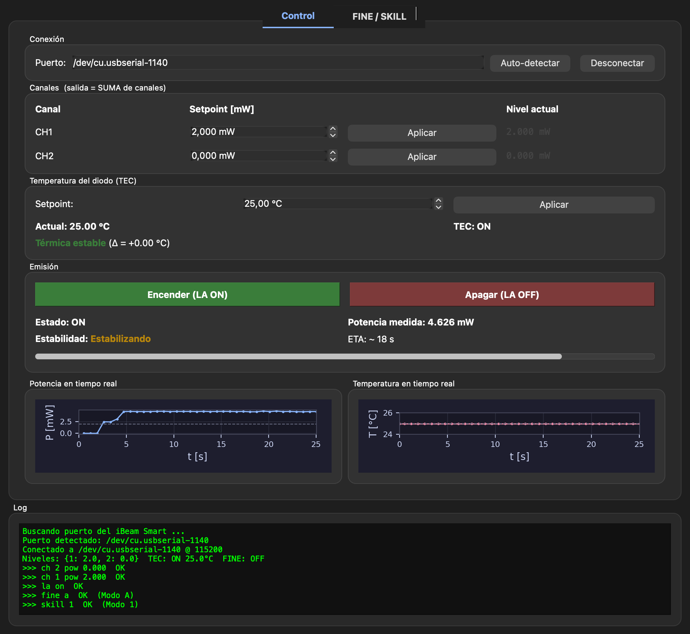
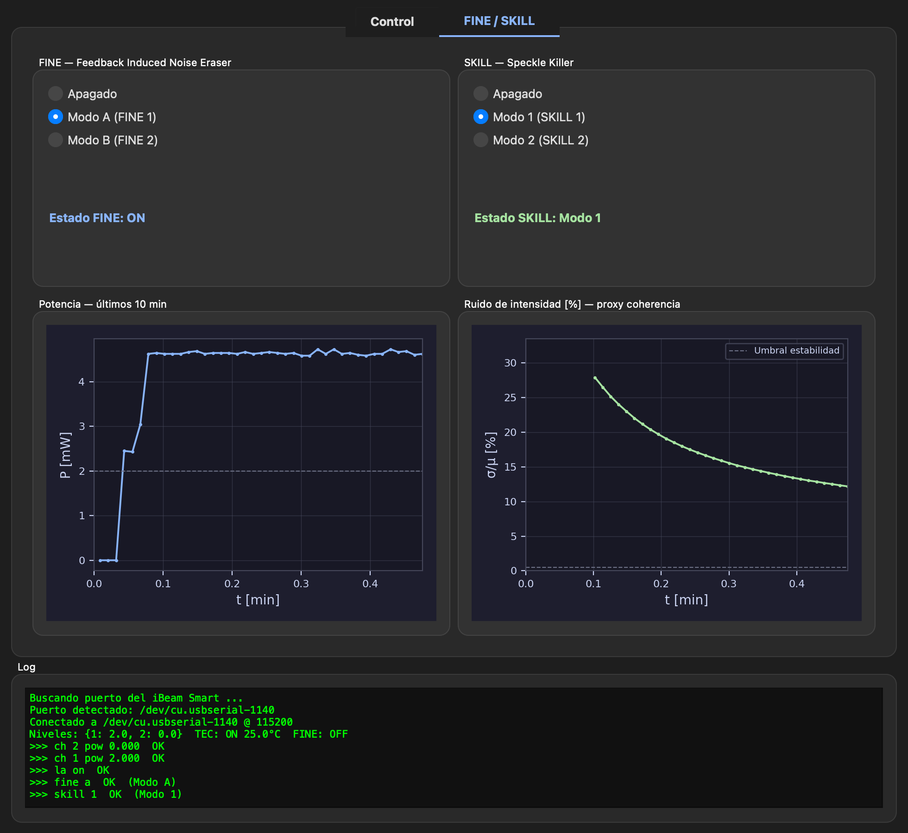

# TOPTICA iBeam Smart + Thorlabs SPCM50A/M — Control

Software de control para el láser diodo **TOPTICA iBeam Smart** (RS-232) y
para el contador de fotones **Thorlabs SPCM50A/M** (USB HID). Incluye:

**Láser TOPTICA iBeam Smart**
- **Script CLI** (`ibeam_encender.py`) — enciende el láser, mide potencia y
  temperatura, grafica la evolución temporal y apaga.
- **GUI** (`ibeam_gui.py`) — aplicación PyQt6 con dos pestañas:
  *Control* (potencia, temperatura, estabilidad, gráficas P(t)/T(t)) y
  *FINE / SKILL* (deslizadores 0–2 para control de ruido e incoherencia de
  speckle, recuadros HELP, gráficas a largo plazo).
- **App macOS** (`dist/iBeamSmart.app`) — empaquetada con PyInstaller.

**Thorlabs SPCM50A/M — Single Photon Counter**
- **GUI** (`spcm_gui.py`) — aplicación PyQt6 con dos pestañas:
  *Medición* (display digital de tasa de conteo, T integración, modo
  continuo/única, umbral de alerta, estadísticas en vivo, gráfica P(t)) y
  *Análisis* (histograma, traza 10 min, estadísticas globales, exportación CSV).
- **App macOS** (`dist/SPCM50AM.app`) — empaquetada con PyInstaller.
- **Modo simulación** automático si el dispositivo no está conectado
  (distribución de Poisson + deriva lenta realista).

| Pestaña Control | Pestaña FINE / SKILL |
|---|---|
|  |  |

---

## Características

- **Detección automática del puerto**: sondea los puertos serie
  (`/dev/cu.usbserial-*`, `/dev/cu.usbmodem*`, `COM*`, `/dev/ttyUSB*`…) y elige
  el primero que responda al prompt `CMD> ` a 115200 baud.
- **Conexión automática**: al abrir la app se conecta en cuanto encuentra el
  láser — no hace falta pulsar nada.
- **Control de canales**: cada canal (CH1, CH2) se configura en mW de forma
  independiente; la salida del láser es la **suma** de los canales activos,
  por lo que para que el control sea intuitivo conviene dejar un canal en 0.
- **Telemetría en vivo**: polling cada 700 ms del estado (`ON`/`OFF`), la
  potencia real medida por el fotodiodo interno y la temperatura del diodo.
- **Control y monitoreo de temperatura (TEC)**: muestra el setpoint del TEC,
  la temperatura medida y un indicador de estabilidad térmica
  (|T − setpoint| < 0.3 °C). El campo de setpoint permite intentar fijar
  un nuevo valor (ver *Acceso restringido al setpoint del TEC* más abajo).
- **Indicador de estabilidad de potencia**: detecta si la potencia ya
  alcanzó régimen estacionario (variación relativa < 0.5 % en una ventana
  móvil de 8 s) y muestra una barra de progreso y un ETA estimado para
  alcanzar la estabilidad. El ETA usa un modelo exponencial con τ ≈ 25 s
  típico del calentamiento del diodo.
- **Gráficos en tiempo real (pestaña Control)**: potencia P(t) y temperatura
  T(t), ventana deslizante de 60 s, paleta dark con setpoints marcados.
- **FINE — Feedback Induced Noise Eraser** (pestaña FINE/SKILL): activa el
  lazo de retroalimentación con el fotodiodo interno mediante un **deslizador**
  de tres posiciones: *Apagado* / *Modo A* (`fine a`) / *Modo B* (`fine b`).
  Estado leído del dispositivo con `sta fine`. Incluye recuadro HELP en la UI.
- **SKILL — Speckle Killer** (pestaña FINE/SKILL): reduce el speckle en
  acoplamiento a fibra mediante **deslizador**: *Apagado* / *Modo 1* (`skill 1`) /
  *Modo 2* (`skill 2`). Estado rastreado localmente. Incluye recuadro HELP en la UI.
- **Gráficas a largo plazo** (pestaña FINE/SKILL): potencia P(t) en
  minutos (últimos 10 min) y ruido de intensidad σ/μ [%] como proxy de
  coherencia — disminuye a medida que el láser se estabiliza.
- **Paleta dark** en todos los gráficos (fondo oscuro, curvas en azul,
  rojo y verde, grilla tenue) integrada con la estética de la app.
- **Apagado seguro**: cerrar la ventana envía `la off` antes de liberar el
  puerto.

## Hardware y conexión

```
[ iBeam Smart ] --RS-232 DB-9-- [ Adaptador USB-Serial (CH340/FTDI) ] --USB-- [ Mac ]
```

Parámetros serie (detectados automáticamente por el código, fijados por
el firmware del iBeam Smart):

| Parámetro    | Valor     |
|--------------|-----------|
| Baud rate    | 115200    |
| Data bits    | 8         |
| Stop bits    | 1         |
| Parity       | None      |
| Flow control | None      |
| Prompt       | `CMD> `   |

---

## Instalación

Requiere Python 3.11+ en Linux/macOS/Windows.

```bash
python3 -m venv venv
source venv/bin/activate            # Linux/macOS
# .\venv\Scripts\activate            # Windows
pip install pyserial PyQt6 matplotlib
```

Para construir el ejecutable:

```bash
pip install pyinstaller
```

---

## Uso del script CLI

`ibeam_encender.py` enciende el láser a 5 mW en CH1 (CH2 = 0), adquiere
durante 12 s la potencia y la temperatura del diodo, evalúa la estabilidad
en tiempo real y guarda un gráfico de doble panel.

```bash
source venv/bin/activate
python ibeam_encender.py
```

Salida típica:

```
Conectando a iBeam Smart en /dev/cu.usbserial-1140 a 115200 baud ...
Estado inicial    : OFF
TEC               : ON, setpoint = 25.0 °C, actual = 25.0 °C
Niveles           :
CH1, PWR:  2.000 mW
CH2, PWR:  0.000 mW

Configurando CH1 a 5.0 mW (CH2 = 0 mW) ...
Encendiendo láser ...
Estado            : ON
Potencia inicial  : 4.987 mW

Adquiriendo potencia y temperatura durante 12 s ...
  t=11.8 s  P=5.001 mW  T=25.00 °C  [ESTABLE       ]  ETA: 0 s

Apagando láser ...
Estado final      : OFF
Gráfico guardado: potencia_laser.png
```


> ⚠ El puerto está fijado en el script. Si tu adaptador se enumera en otra
> posición, usa la función `detectar_puerto()` de `ibeam_gui.py` o importa
> `IBeamDriver` directamente.

---

## Uso de la GUI

### Desde fuente

```bash
source venv/bin/activate
python ibeam_gui.py
```

### Desde la app empaquetada (macOS)

```bash
open dist/iBeamSmart.app
```

O arrastra `iBeamSmart.app` a `/Applications` y ábrela como cualquier otra
aplicación.

### Tutorial paso a paso

1. **Abre la app** — al arrancar, busca automáticamente el puerto del iBeam
   Smart y se conecta. La caja *Puerto* se rellena con la ruta detectada y
   el botón pasa a *Desconectar*.
2. **Configura las potencias**: escribe el setpoint en mW de CH1 y CH2 y pulsa
   *Aplicar* en cada canal. El campo *Nivel actual* refleja lo que el
   dispositivo tiene memorizado ahora mismo.
3. **Verifica la temperatura**: el bloque *Temperatura del diodo (TEC)*
   muestra el setpoint del TEC (típicamente 25.0 °C de fábrica), la
   temperatura medida y el estado del lazo termoeléctrico. Cuando
   |T − setpoint| < 0.3 °C aparece *Térmica estable* en verde.
4. **Enciende** pulsando el botón verde *Encender (LA ON)*. El área *Emisión*
   muestra `Estado: ON` y la potencia medida por el fotodiodo (mW).
5. **Observa la estabilización**: la barra y el rótulo *Estabilidad* indican
   si el láser está *Calentando*, *Estabilizando* o *Estabilizado*. Junto
   al ETA verás un tiempo estimado para alcanzar régimen estacionario
   (criterio: variación relativa < 0.5 % en 8 s). Cada cambio de setpoint
   reinicia esta medida.
6. **Sigue los gráficos en tiempo real**: debajo del panel de emisión
   aparecen dos gráficas en paralelo que se actualizan cada ~700 ms:
   - **Potencia en tiempo real** — curva azul con línea gris discontinua en
     el setpoint actual (suma de canales).
   - **Temperatura en tiempo real** — curva roja con línea en el setpoint
     del TEC. La ventana muestra los últimos 60 s y se desplaza sola.
7. **Modula en vivo**: cambia el setpoint de un canal y pulsa *Aplicar*; el
   cambio se refleja inmediatamente en la potencia medida y vuelve a contar
   la estabilización. Los gráficos continúan acumulando historia.
8. **Apaga** con *Apagar (LA OFF)* o simplemente cerrando la ventana
   (la app envía `la off` automáticamente antes de salir).

### Pestaña FINE / SKILL

Cambia a la pestaña *FINE / SKILL* para acceder a las funciones de
reducción de ruido e incoherencia:

**FINE (Feedback Induced Noise Eraser)**
Activa el lazo de retroalimentación interno con el fotodiodo integrado.
Usa el **deslizador** horizontal con tres posiciones de encaje:

| Posición | Comando enviado | Descripción |
|----------|-----------------|-------------|
| 0 — Apagado | `fine off` | Lazo desactivado |
| 50 — Modo A | `fine on` + `fine a` | Reducción de ruido de baja frecuencia (≲ 100 Hz). Corrige ruido mecánico y de la corriente de bombeo. |
| 100 — Modo B | `fine on` + `fine b` | Lazo extendido hasta ≈ 10 MHz. Reduce fluctuaciones rápidas de amplitud; ideal cuando la coherencia temporal es crítica. |

El estado real del dispositivo se lee con `sta fine` cada ciclo de polling.
Un pequeño recuadro **HELP** en la interfaz resume estos modos sin salir de la app.

**SKILL (Speckle Killer)**
Reduce el speckle al acoplar a fibra óptica. Usa el **deslizador** horizontal:

| Posición | Comando enviado | Descripción |
|----------|-----------------|-------------|
| 0 — Apagado | `skill off` | Modulación desactivada |
| 50 — Modo 1 | `skill on` + `skill 1` | Modulación de fase de baja amplitud (~π/4). Reducción leve de speckle; mínimo impacto en coherencia temporal. |
| 100 — Modo 2 | `skill on` + `skill 2` | Modulación de fase de mayor amplitud (~π). Máxima supresión de speckle al acoplar a fibra multimodo. |

El estado SKILL se rastrea localmente (el firmware de este modelo no expone
`sta skill`). Un recuadro **HELP** en la interfaz explica cada modo.

**Gráficas de la pestaña FINE/SKILL**
- *Potencia — últimos 10 min*: historial de potencia en escala de minutos.
  Útil para observar deriva térmica o el efecto de activar FINE.
- *Ruido relativo σ/μ [%] — proxy coherencia*: muestra σ/μ (%) calculado
  sobre una ventana móvil de 30 s. Un valor bajo (< 0.5 %) indica emisión
  estable y alta coherencia de amplitud. La línea discontinua marca el
  umbral de estabilidad (0.5 %).

### Consideración sobre canales

La salida óptica del iBeam Smart equivale a la suma de los canales con
contribución no-nula. **Si sólo quieres controlar CH1, deja CH2 en 0 mW**
(los comandos `en`/`di` no siempre silencian la contribución del canal;
fijar 0 mW sí).

### Acceso restringido al setpoint del TEC

El comando `set temp X` que utiliza la app está protegido en el firmware
estándar del iBeam Smart y devuelve `%SYS-W-047, access restricted`. La
app intercepta esa respuesta y muestra un aviso explicando que el setpoint
de fábrica (25.0 °C, óptimo para esta familia y al que están calibrados
los parámetros de potencia) no puede modificarse sin contraseña de
mantenimiento de TOPTICA. Aun así, la lectura, el monitoreo y el
indicador de estabilidad térmica funcionan siempre.

### Cómo se calcula el ETA de estabilización

Cada lectura de potencia (~1 s) se añade a una ventana móvil de 8 s. Sobre
esa ventana se computan media, desviación estándar y pendiente por mínimos
cuadrados. Sea `rel = max(std/media, |pendiente · ventana|/media)`. El
láser se considera estable si `rel < 0.5 %`. En caso contrario, asumiendo
una aproximación exponencial al régimen estacionario con
`τ ≈ 25 s`, se estima

  `ETA = τ · ln(rel / 0.5 %)`

acotado a `[0, 600] s`. Es una estimación heurística — útil para tener
una idea del orden de magnitud, no para sincronizar adquisiciones críticas.

---

## Empaquetado como app nativa

Se usa PyInstaller con exclusión de módulos no utilizados y firma ad-hoc
para evitar que Gatekeeper re-escanee el binario en cada arranque.
Matplotlib y NumPy se incluyen ahora para los gráficos en tiempo real:

```bash
source venv/bin/activate
pip install pyinstaller Pillow
pyinstaller --windowed --name "iBeamSmart" --noconfirm --optimize 2 \
  --exclude-module tkinter --exclude-module pydoc --exclude-module test \
  --exclude-module scipy \
  --exclude-module PyQt6.QtQml --exclude-module PyQt6.QtQuick \
  --exclude-module PyQt6.QtOpenGL --exclude-module PyQt6.QtMultimedia \
  ibeam_gui.py

xattr -cr dist/iBeamSmart.app
codesign --force --deep --sign - dist/iBeamSmart.app
```

Resultado: `dist/iBeamSmart.app` (~107 MB), arranque en ~0.5 s tras el primer
lanzamiento (matplotlib construye la caché de fuentes en el primer uso).

### Para Windows

PyInstaller no cross-compila. En una máquina Windows con el mismo entorno:

```powershell
pip install pyserial PyQt6 pyinstaller
pyinstaller --windowed --onefile --name iBeamSmart ibeam_gui.py
```

El ejecutable queda en `dist\iBeamSmart.exe`.

---

## Comandos útiles del iBeam Smart (referencia)

| Comando             | Acción                                                |
|---------------------|-------------------------------------------------------|
| `la on` / `la off`  | Encender / apagar la emisión                          |
| `sta la`            | Devuelve `ON` / `OFF`                                 |
| `sh pow`            | Potencia medida por el fotodiodo (`PIC` en µW)        |
| `sh level pow`      | Setpoint actual de cada canal (mW)                    |
| `ch N pow X`        | Fijar setpoint del canal N a X mW                     |
| `en N` / `di N`     | Habilitar / deshabilitar canal N (†)                  |
| `sh temp`           | Temperatura actual del diodo (`TEMP = XXX.X C`)       |
| `sta tec`           | Estado del lazo TEC (`ON` / `OFF`)                    |
| `sh syst data`      | Bloque de configuración: incluye `TEC setpoint`       |
| `set temp X`        | Fijar setpoint del TEC (acceso restringido por defecto)|
| `fine on` / `fine off` | Activar / desactivar FINE                    |
| `fine a` / `fine b`   | Seleccionar modo A o B de FINE               |
| `sta fine`            | Estado FINE (`ON` / `OFF`)                   |
| `skill on` / `skill off` | Activar / desactivar SKILL               |
| `skill 1` / `skill 2`   | Seleccionar modo 1 o 2 de SKILL           |
| `sh ch`             | Estado detallado de canales                    |

† No siempre silencia la contribución; usar `ch N pow 0` para garantizar que
un canal no contribuye a la salida.

---

## Estructura del repositorio

```
TopasIbeamSmart/
├── ibeam_encender.py        # CLI: enciende, mide y apaga el láser
├── ibeam_gui.py             # GUI PyQt6 iBeam Smart (2 pestañas + gráficas)
├── spcm_gui.py              # GUI PyQt6 SPCM50A/M (2 pestañas + gráficas)
├── dist/
│   ├── iBeamSmart.app       # App macOS — control del láser
│   └── SPCM50AM.app         # App macOS — contador de fotones
├── docs/img/
│   ├── gui_tab1.png         # Captura pestaña Control (láser)
│   ├── gui_tab2.png         # Captura pestaña FINE / SKILL (láser)
│   └── potencia_laser.png   # Última ejecución del script CLI
├── potencia_laser.png       # Última ejecución del script CLI
└── README.md
```

---

## GUI del SPCM50A/M — Uso

Aplicación con apariencia y layout del software original **Thorlabs Single
Photon Counter GUI** pero con **tema oscuro Catppuccin Mocha** (igual al
del láser): barra de menú (File / Device / Option / Help), toolbar con
logo THORLABS, banner superior con el estado de conexión, panel izquierdo
con *Operating Mode + Settings + Start + Measurement Properties +
Occurrences*, panel derecho con cuatro pestañas
(*Alignment / Table / Graph / Bar*) y status bar con número de serie.

### Modos de operación de la app

La app distingue tres estados, indicados por un **banner de color** en la
parte superior de la ventana:

| Banner | Significado | Datos mostrados |
|--------|-------------|-----------------|
| 🟢 verde *DISPOSITIVO CONECTADO* + (protocolo implementado) | SPCM50A real, leyendo bins por USB | Datos reales del Si APD |
| 🟡 ámbar *DISPOSITIVO CONECTADO — protocolo sin implementar* | SPCM50A real detectado, pero el protocolo binario propietario de Thorlabs aún no está implementado | **Simulador** (~50 cps dark counts), no datos reales |
| 🟣 lila *MODO SIMULACIÓN* | Sin dispositivo USB | Simulador (~50 cps dark counts) |

> ⚠ **Importante**: Mientras `DriverSPCM.leer_array()` no esté implementado,
> el conteo en pantalla **siempre proviene del simulador** aunque el
> dispositivo esté conectado. El simulador reproduce dark counts típicos
> de un Si APD a temperatura ambiente (~50 cps con sensor cubierto),
> que es lo que se espera al verificar el ruido electrónico del detector.

### Vista en vivo

El conteo se actualiza **en tiempo real** durante la adquisición, sin
esperar a que termine el array completo:

- **Display LCD grande** en la pestaña Alignment con la tasa media en cps
  (verde si < 1000 cps, ámbar 1k–100k, rojo > 100k)
- Trazo de la tasa vs tiempo (últimos 60 s)
- Panel *Measurement Properties* (Number of Bins, Max/Avg/Min Photon Count,
  Difference Max/Min) actualizado a ~50 Hz
- Pestañas **Graph / Bar / Table** se actualizan progresivamente
  conforme entran los bins (sólo la pestaña activa, para mantener fluidez)

### Instalación de dependencias

```bash
source venv/bin/activate
brew install libusb            # solo primera vez (macOS)
pip install pyusb numpy PyQt6 matplotlib
```

### Desde fuente

```bash
source venv/bin/activate
python spcm_gui.py
```

### Desde la app empaquetada (macOS)

```bash
open dist/SPCM50AM.app
```

La app incluye `libusb-1.0.0.dylib` dentro del bundle, por lo que **no
requiere Homebrew en la máquina destino**.

### Detección automática

Al arrancar, la app escanea el bus USB buscando dispositivos Thorlabs
(VID `0x1313`, PID `0x8098` para el SPCM50A). Si encuentra el dispositivo,
se conecta inmediatamente y muestra el número de serie en la status bar
(p. ej. `SPCM50A  S/N: M00296614`).

Si no detecta hardware (o si el protocolo USB aún no está implementado),
arranca en **modo simulación** con fotocuentas Poisson + deriva lenta.

Para inspeccionar manualmente los dispositivos USB conectados:
**Device → List ports…**

### Pestañas

| Pestaña | Contenido |
|---------|-----------|
| **Alignment** | Display LCD grande con la tasa media de conteo (cps / kcps / Mcps) y traza en tiempo real de los últimos 60 s. Útil para alinear el haz sobre el detector maximizando la cuenta. |
| **Table** | Tabla con `Bin Number` y `Counts` (limitada a 5000 filas para fluidez). |
| **Graph** | Línea: `Counts per Bin` vs `Bin Number` — vista por defecto, idéntica al software de Thorlabs. |
| **Bar** | Barras: si el array tiene más de 200 bins, se agrupan automáticamente. |

### Settings (panel izquierdo)

Idéntico al software original:

| Campo | Default | Significado |
|-------|---------|-------------|
| Bin Length [ms] | 1.000 | Duración de cada bin |
| Time between Bins [ms] | 0.001 | Pausa entre bins consecutivos |
| Pulse Blind Time [ns] | 0.000 | Dead time configurable |
| Trigger edge | — | Sólo activo en modos triggered |
| Array Measurement | ☑ | Adquirir un array completo |
| Continuously | ☐ | Repetir arrays indefinidamente |
| Bins per Array | 10 000 | Tamaño del array |

Modos de operación: **Free Running Timed Counter** (default), **Triggered
Timed Counter**, **Single Photon Counter**.

### Measurement Properties

Bloque de sólo lectura que se actualiza tras cada adquisición:
`Start of Measurement`, `Duration`, barra de progreso, `Number of Bins`,
`Max./Average/Min. Photon Count`, `Difference Max/Min`, `USB transfer
rate (measurements/s)`.

### Occurrences during Measurement

Banderas de estado: `Values lost`, `Overtemperature occured`,
`Overflow occured`, `Saturation of APD`. Se ponen rojas si el dispositivo
las dispara durante la medición.

### Exportación

`File → Save data as CSV…` (o el botón de la toolbar) genera un CSV
con columnas `bin_number, counts`.

### Información USB del dispositivo

Verificada en la unidad `M00296614`:

| Atributo | Valor |
|----------|-------|
| Vendor ID  | `0x1313` (Thorlabs) |
| Product ID | `0x8098` |
| Interface class | `0xFE` subclass `0x03` (Application Specific) |
| EP `0x02` OUT | bulk, 64 B (comandos) |
| EP `0x82` IN  | bulk, 64 B (datos) |
| EP `0x81` IN  | interrupt, 2 B (estado) |

### Implementar el protocolo binario

`DriverSPCM.conectar()` ya configura la interfaz USB y reserva el
endpoint. Falta capturar el protocolo binario propietario (los bytes
exactos que el "Thorlabs Single Photon Counter GUI" envía/recibe).

Pasos sugeridos:

1. En Windows, instalar Wireshark + USBPcap.
2. Mientras se ejecuta el software de Thorlabs, capturar la sesión.
3. Identificar las secuencias de comando (setup, start, lectura).
4. Reemplazar el cuerpo de `DriverSPCM.leer_array()` y
   `DriverSPCM.leer_estado()` con las llamadas correspondientes a
   `dev.write(EP_BULK_OUT, ...)` y `dev.read(EP_BULK_IN, ...)`.

Mientras el protocolo no esté implementado, la GUI muestra el dispositivo
**conectado** en la status bar pero usa el simulador para producir datos
(la primera adquisición lo indica en el log).

### Empaquetado como app macOS

```bash
source venv/bin/activate
pip install pyinstaller pyusb
brew install libusb

LIBUSB=$(find /opt/homebrew/Cellar/libusb -name "libusb-1.0.0.dylib" | head -1)

pyinstaller --windowed --name "SPCM50AM" --noconfirm --optimize 2 \
  --exclude-module tkinter --exclude-module pydoc --exclude-module test \
  --exclude-module scipy \
  --exclude-module PyQt6.QtQml --exclude-module PyQt6.QtQuick \
  --exclude-module PyQt6.QtOpenGL --exclude-module PyQt6.QtMultimedia \
  --add-binary "$LIBUSB:." \
  --hidden-import usb.backend.libusb1 \
  spcm_gui.py

xattr -cr dist/SPCM50AM.app
codesign --force --deep --sign - dist/SPCM50AM.app
```
