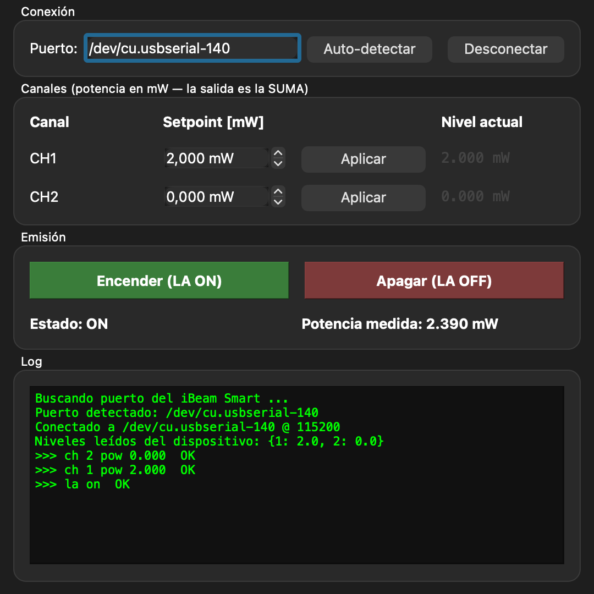
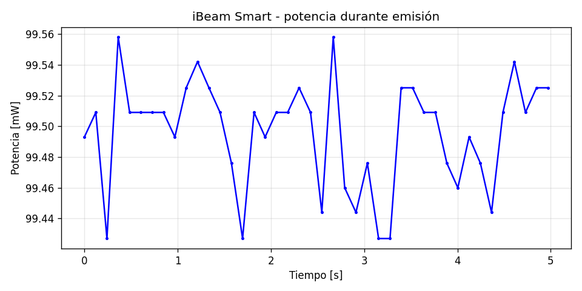

# TOPTICA iBeam Smart — Control

Control por software de un láser diodo **TOPTICA iBeam Smart** a través de su
puerto serie RS-232 (usando un adaptador USB-Serial). Incluye:

- **Script CLI** (`ibeam_encender.py`) — enciende el láser, mide potencia,
  grafica la evolución temporal y apaga.
- **GUI** (`ibeam_gui.py`) — aplicación PyQt6 con detección automática de
  puerto, control de canales y encendido/apagado de emisión.
- **App macOS** (`dist/iBeamSmart.app`) — la GUI empaquetada como
  aplicación nativa (PyInstaller).



---

## Características

- **Detección automática del puerto**: sondea los puertos serie
  (`/dev/cu.usbserial-*`, `/dev/cu.usbmodem*`, `COM*`, `/dev/ttyUSB*`…) y elige
  el primero que responda al prompt `CMD> ` a 115200 baud.
- **Conexión automática**: al abrir la app se conecta en cuanto encuentra el
  láser — no hace falta pulsar nada.
- **Control de canales**: cada canal (CH1, CH2) se configura en mW de forma
  independiente; la salida del láser es la **suma** de los canales activos,
  por lo que para que el control sea intuitivo conviene dejar un canal en 0.
- **Telemetría en vivo**: polling cada 700 ms del estado (`ON`/`OFF`) y la
  potencia real medida por el fotodiodo interno.
- **Apagado seguro**: cerrar la ventana envía `la off` antes de liberar el
  puerto.

## Hardware y conexión

```
[ iBeam Smart ] --RS-232 DB-9-- [ Adaptador USB-Serial (CH340/FTDI) ] --USB-- [ Mac ]
```

Parámetros serie (detectados automáticamente por el código, fijados por
el firmware del iBeam Smart):

| Parámetro    | Valor     |
|--------------|-----------|
| Baud rate    | 115200    |
| Data bits    | 8         |
| Stop bits    | 1         |
| Parity       | None      |
| Flow control | None      |
| Prompt       | `CMD> `   |

---

## Instalación

Requiere Python 3.11+ en Linux/macOS/Windows.

```bash
python3 -m venv venv
source venv/bin/activate            # Linux/macOS
# .\venv\Scripts\activate            # Windows
pip install pyserial PyQt6 matplotlib
```

Para construir el ejecutable:

```bash
pip install pyinstaller
```

---

## Uso del script CLI

`ibeam_encender.py` enciende el láser al 5 mW en CH1, mide la potencia durante
5 s y guarda una gráfica.

```bash
source venv/bin/activate
python ibeam_encender.py
```

Salida típica:

```
Conectando a iBeam Smart en /dev/cu.usbserial-140 a 115200 baud ...
Estado inicial : OFF
Niveles        :
CH1, PWR:  5.000 mW
CH2, PWR:  0.000 mW
Encendiendo láser ...
Estado         : ON
Potencia       : 5.010 mW
Midiendo potencia durante 5 s ...
Apagando láser ...
Estado final   : OFF
Gráfico guardado: potencia_laser.png
```



> ⚠ El puerto está fijado en el script. Si tu adaptador se enumera en otra
> posición, usa la función `detectar_puerto()` de `ibeam_gui.py` o importa
> `IBeamDriver` directamente.

---

## Uso de la GUI

### Desde fuente

```bash
source venv/bin/activate
python ibeam_gui.py
```

### Desde la app empaquetada (macOS)

```bash
open dist/iBeamSmart.app
```

O arrastra `iBeamSmart.app` a `/Applications` y ábrela como cualquier otra
aplicación.

### Tutorial paso a paso

1. **Abre la app** — al arrancar, busca automáticamente el puerto del iBeam
   Smart y se conecta. La caja *Puerto* se rellena con la ruta detectada y
   el botón pasa a *Desconectar*.
2. **Configura las potencias**: escribe el setpoint en mW de CH1 y CH2 y pulsa
   *Aplicar* en cada canal. El campo *Nivel actual* refleja lo que el
   dispositivo tiene memorizado ahora mismo.
3. **Enciende** pulsando el botón verde *Encender (LA ON)*. El área *Emisión*
   muestra `Estado: ON` y la potencia medida por el fotodiodo (mW).
4. **Modula en vivo**: cambia el setpoint de un canal y pulsa *Aplicar*; el
   cambio se refleja inmediatamente en la potencia medida.
5. **Apaga** con *Apagar (LA OFF)* o simplemente cerrando la ventana
   (la app envía `la off` automáticamente antes de salir).

### Consideración sobre canales

La salida óptica del iBeam Smart equivale a la suma de los canales con
contribución no-nula. **Si sólo quieres controlar CH1, deja CH2 en 0 mW**
(los comandos `en`/`di` no siempre silencian la contribución del canal;
fijar 0 mW sí).

---

## Empaquetado como app nativa

Se usa PyInstaller con exclusión de módulos pesados no utilizados y firma
ad-hoc para evitar que Gatekeeper re-escanee el binario en cada arranque:

```bash
source venv/bin/activate
pip install pyinstaller
pyinstaller --windowed --name "iBeamSmart" --noconfirm --optimize 2 \
  --exclude-module tkinter --exclude-module unittest --exclude-module pydoc \
  --exclude-module test --exclude-module matplotlib --exclude-module numpy \
  --exclude-module scipy --exclude-module PIL \
  --exclude-module PyQt6.QtQml --exclude-module PyQt6.QtQuick \
  --exclude-module PyQt6.QtOpenGL --exclude-module PyQt6.QtMultimedia \
  ibeam_gui.py

xattr -cr dist/iBeamSmart.app
codesign --force --deep --sign - dist/iBeamSmart.app
```

Resultado: `dist/iBeamSmart.app` (~74 MB), arranque en ~0.2 s tras el primer
lanzamiento.

### Para Windows

PyInstaller no cross-compila. En una máquina Windows con el mismo entorno:

```powershell
pip install pyserial PyQt6 pyinstaller
pyinstaller --windowed --onefile --name iBeamSmart ibeam_gui.py
```

El ejecutable queda en `dist\iBeamSmart.exe`.

---

## Comandos útiles del iBeam Smart (referencia)

| Comando             | Acción                                         |
|---------------------|------------------------------------------------|
| `la on` / `la off`  | Encender / apagar la emisión                   |
| `sta la`            | Devuelve `ON` / `OFF`                          |
| `sh pow`            | Potencia medida por el fotodiodo (`PIC` en µW) |
| `sh level pow`      | Setpoint actual de cada canal (mW)             |
| `ch N pow X`        | Fijar setpoint del canal N a X mW              |
| `en N` / `di N`     | Habilitar / deshabilitar canal N (†)           |
| `sh ch`             | Estado detallado de canales                    |

† No siempre silencia la contribución; usar `ch N pow 0` para garantizar que
un canal no contribuye a la salida.

---

## Estructura del repositorio

```
TopasIbeamSmart/
├── ibeam_encender.py     # Script CLI + gráfica de potencia
├── ibeam_gui.py          # GUI PyQt6 (driver + ventana)
├── dist/                 # App empaquetada (PyInstaller)
│   └── iBeamSmart.app
├── docs/img/             # Capturas y gráficos usados en este README
├── potencia_laser.png    # Última ejecución del script CLI
└── README.md
```
